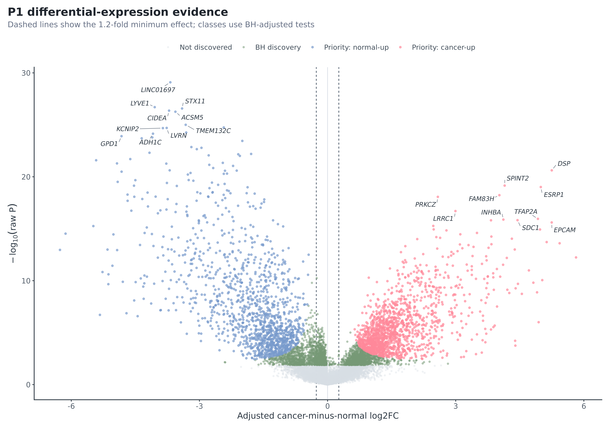
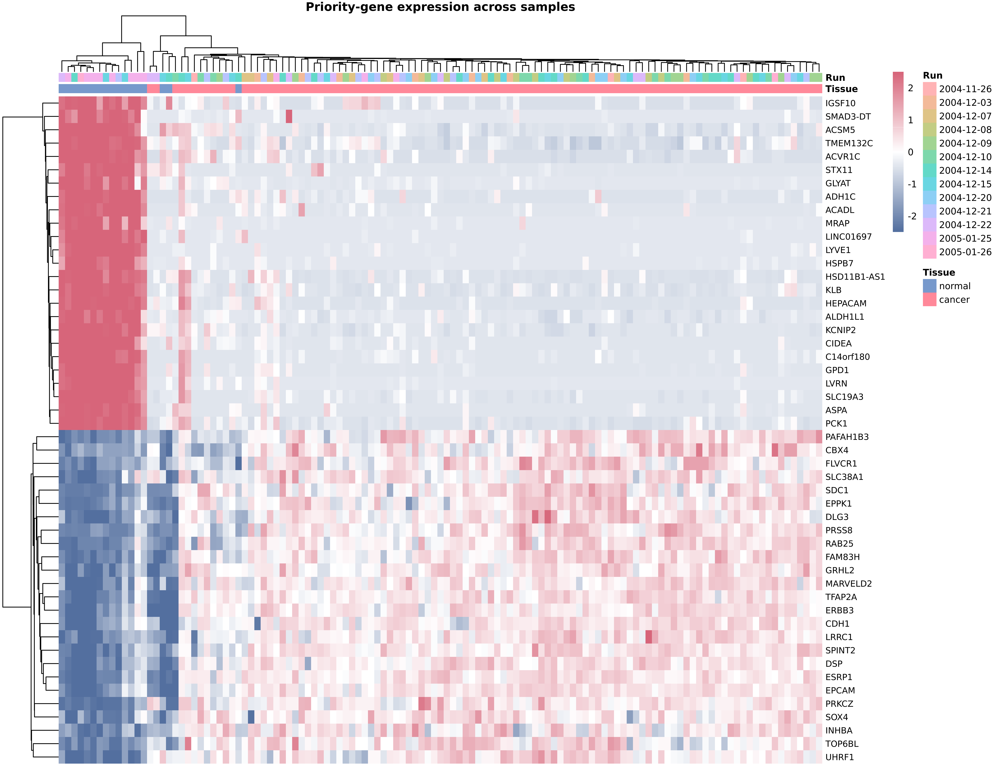
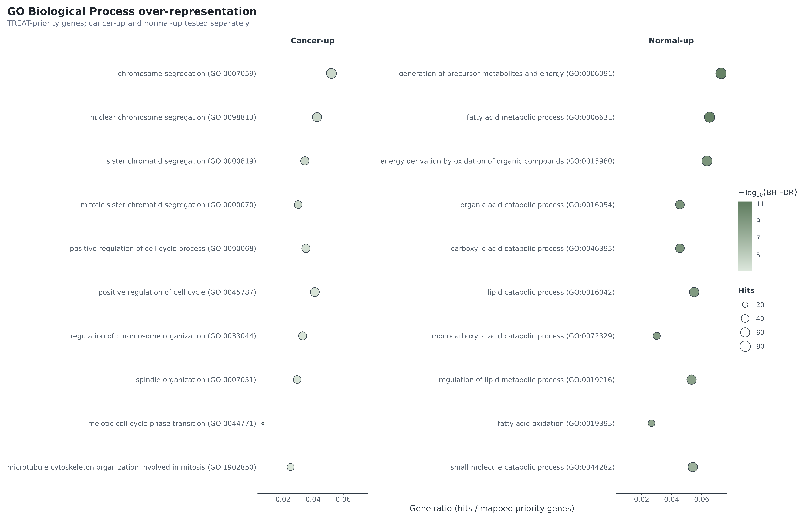
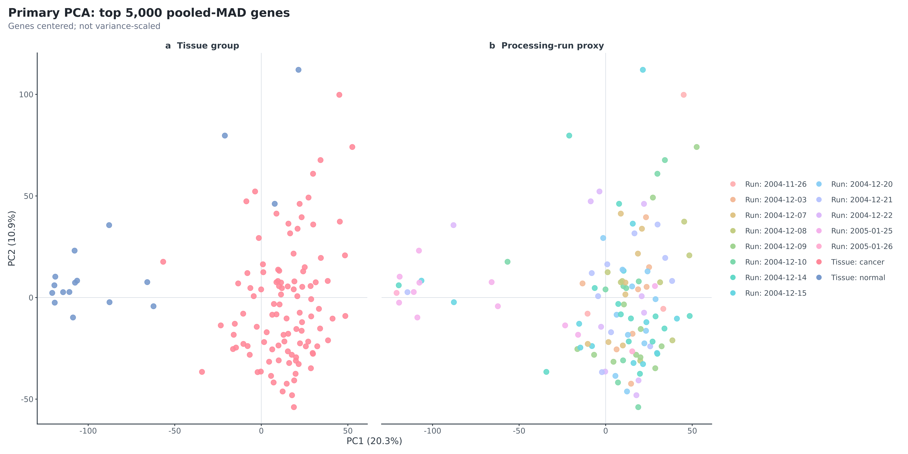

# GSE42568 — 乳腺癌表达谱分析

[English](README.md) ｜ **简体中文**

> **作品集案例**
>
> 对公开乳腺癌表达谱数据集开展端到端分析，覆盖 GEO 数据获取、质量控制、差异表达、通路富集、可复现报告和科学质量审查。

**展示的交付能力：** QC · PCA · 差异表达 · 火山图/热图 · GO/Reactome 富集 · GSEA · 可复现代码 · 发表级图表 · 客户报告

<table>
<tr>
<td width="50%"><br><sub>差异表达证据</sub></td>
<td width="50%"><br><sub>重点基因表达模式</sub></td>
</tr>
<tr>
<td width="50%"><br><sub>GO 生物过程富集</sub></td>
<td width="50%"><br><sub>主要样本层面 PCA</sub></td>
</tr>
</table>

## 本案例展示了什么

这个范围明确、模拟客户交付的工作流分析了 [GEO GSE42568](https://www.ncbi.nlm.nih.gov/geo/query/acc.cgi?acc=GSE42568) 中 GPL570 平台的 **104 例乳腺癌**与 **17 例正常乳腺组织**样本。工作流从 GEO 官方 processed expression matrix 出发，完成样本与表达矩阵 QC、当前版本探针注释、纳入处理批次代理变量的 limma 建模、敏感性分析、符合许可要求的功能富集、客户报告以及正式 Scientific QA，形成可审计交付。

本项目估计的是横断面 bulk tissue 中的 **cancer-minus-normal 关联**，不用于诊断、预后、因果推断或治疗反应预测。

## 结果概览

- 共检验 20,357 个 Entrez 基因；5,381 个基因通过 moderated t 检验的 BH 校正。
- TREAT 1.2-fold 标准得到 2,835 个重点基因（1,497 个 cancer-up；1,338 个 normal-up）；其中 2,745 个符合主要结论纳入条件。
- P1/S1 Spearman rho 为 0.936，P1/S2 为 1.000；重点基因方向一致率为 100%。
- 完整分析 QA 32/32、可复现性守卫测试 13/13、干净重建核心表哈希 10/10 一致；设计状态为 **Green**。
- 未访问 KEGG 和 MSigDB 内容；Reactome 是经过记录且符合许可要求的替代方案。

## 在 Linux 上复现

仓库不包含任何机器特定的项目路径或 Conda 路径。在仓库根目录运行：

```bash
conda env create -f config/environment.yml
conda activate bioinfo
bash scripts/run_all.sh
```

运行器从当前 `PATH` 解析 `Rscript`、`python` 和 `conda`。如有需要，也可显式指定环境前缀：

```bash
BIOINFO_ENV_PREFIX="$CONDA_PREFIX" bash scripts/run_all.sh
```

项目通过固定版本的 Conda 环境实现复现：`config/environment.yml` 是可移植环境规范，`config/conda-explicit-linux-64.txt` 是经过验证的 Linux 精确软件包记录。仓库同时保留 Python freeze 和 R `sessionInfo()`，不再使用独立的 `renv.lock`。

下载器会校验 GEO 官方文件大小、gzip 完整性和 SHA-256。公开版有意不包含下载输入和生成的表达矩阵，这些内容会由 pipeline 重新构建。

## 公开版完整性

完整分析工作区已通过 32/32 项 Scientific QA。公开作品集版本有意省略数据、运行日志、高容量作图源表以及完整工作区 inventory。独立的纳入与完整性规则见[公开作品集版本验收](docs/PUBLIC_PORTFOLIO_ACCEPTANCE.md)；QA031 仍明确限定为对完整分析工作区的检查。

## 类似分析

如需开展类似的 GEO 或转录组分析，可通过 [ykx22@outlook.com](mailto:ykx22@outlook.com) 联系作者 **Ano-neko**。

## 项目导航

- 客户报告：[PDF](output/pdf/client_report.pdf) · [HTML](reports/client_report.html)
- 方法附录：[PDF](output/pdf/methods_appendix.pdf) · [HTML](reports/methods_appendix.html)
- QC 附录：[PDF](output/pdf/qc_appendix.pdf) · [HTML](reports/qc_appendix.html)
- [Scientific QA](docs/SCIENTIFIC_QA.md) · [正式分析设计](GSE42568_PROJECT_DESIGN.md)
- [交付验收与项目目录说明](docs/DELIVERY_ACCEPTANCE.md)
- [重点差异表达结果](results/tables/de_priority_genes.tsv) · [基因集与许可清单](results/tables/gene_set_manifest.tsv)

## 局限性

正常组织的具体来源、年龄和配对关系未知；处理批次与分组存在部分混杂；bulk tissue 组成差异及癌症异质性仍然存在；processed data 无法提供 CEL 层面的 QC；v1 未包含外部队列验证。详见[局限性说明](docs/limitations.md)。

代码采用 MIT 许可证。仓库保留 GEO/数据来源归属以及 GO/Reactome 版本信息；不重新分发 KEGG 和 MSigDB 内容。
