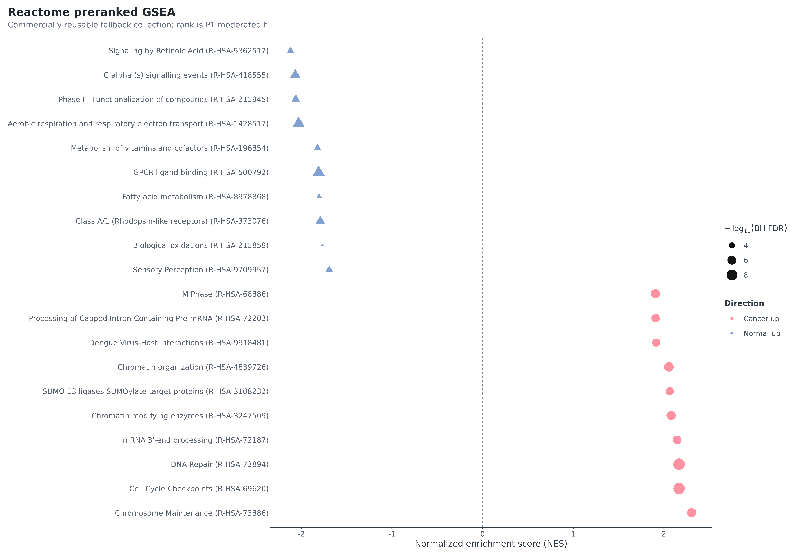
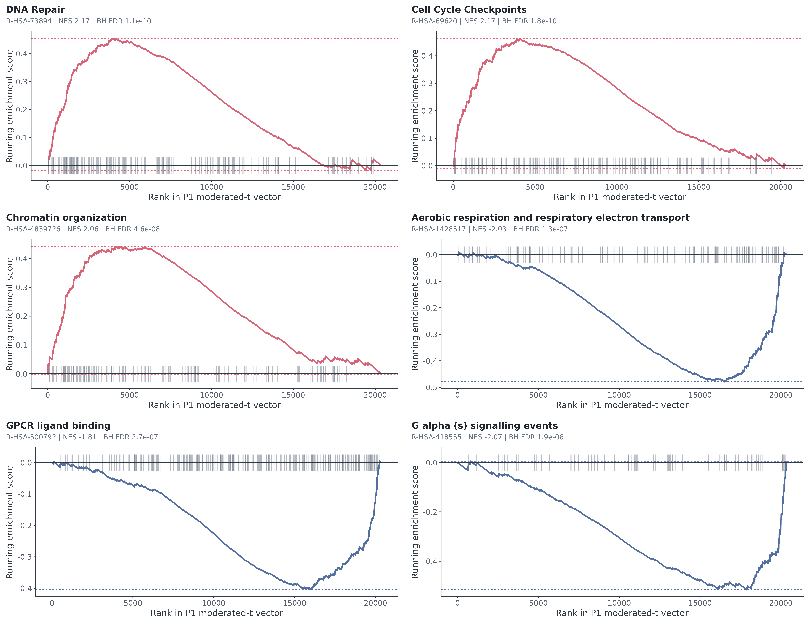

[TOC]

# Executive summary

This analysis compares **104 breast cancer biopsies with 17 normal breast tissue samples** in GEO GSE42568. It uses the deposited log2 GCRMA matrix and a run-adjusted limma model. The target is an average **cancer-minus-normal bulk-tissue expression association**—not a causal effect, clinical classifier, prognosis model, or treatment-response model.

The workflow passed **32/32 Scientific QA checks** and 13/13 reproducibility guards. A clean rebuild from the checksum-locked official inputs reproduced **10/10 key result tables byte-for-byte**. Of **20,357 unique Entrez genes**, **5,381** reached moderated BH FDR < 0.05; **2,835** met TREAT BH FDR < 0.05 while directly testing an absolute effect greater than 1.2-fold (1,497 cancer-up; 1,338 normal-up). **2,745** also passed probe and sensitivity interpretation checks.

> **Release decision:** suitable as an auditable portfolio/client-style discovery analysis with explicit limitations. It is not a diagnostic product or evidence that a pathway is activated, causal, or druggable.

# Data and boundary

The official [GEO record](https://www.ncbi.nlm.nih.gov/geo/query/acc.cgi?acc=GSE42568) reports 104 pretreatment breast cancer biopsies and 17 normal breast tissues on GPL570 and cites Clarke et al. ([PMID 23740839](https://pubmed.ncbi.nlm.nih.gov/23740839/)). Normal-tissue donor/source status is not established, so this report never calls them healthy, adjacent, reduction-mammoplasty, or matched controls.

- Matrix SHA-256: `43b93f72f1d81838dcd2a5b6ccc3bc1875e46230dad0d7346236773a99e32b76`.
- 54,675 probe sets × 121 samples; finite deposited log2 GCRMA signals.
- No second log, re-normalization, imputation or ComBat was applied to the DE response.
- P1: `expression ~ processing_run_proxy + tissue_group`; normal reference.
- Thirteen run-proxy levels; six mixed levels containing 62 samples.

# QC and design

Annotation retained 39,815 eligible probes and resolved 20,357 unique Entrez genes by an outcome-blind representative rule. Four samples triggered multi-category processed-data warnings. They show no gross matrix failure and have no raw-array corroboration, so all remain in P1; a separate 117-sample sensitivity measures influence.

The design is full rank (14/14; residual df 107). Cancer-only run levels do not provide within-run group contrast once their fixed effects are included, explaining why P1 and the 62-sample mixed-run S2 estimates are identical.

| Comparison | n | Spearman | Pearson | Priority sign | Median \|effect\| ratio |
| --- | --- | --- | --- | --- | --- |
| S1_group_only | 121 | 0.936 | 0.975 | 100.0% | 1.069 |
| S2_mixed_runs | 62 | 1.000 | 1.000 | 100.0% | 1.000 |
| QC_candidate_exclusion | 117 | 0.912 | 0.975 | 100.0% | 1.100 |
| S4_no_trend | 121 | 1.000 | 1.000 | 100.0% | 1.000 |
| S4_group_aware | 121 | 0.962 | 0.993 | 100.0% | 1.006 |
| median_collapse | 121 | 0.874 | 0.902 | 97.0% | 0.960 |

The design traffic light is **Green**. Removing the normal-heavy 2005-01-25 run retains Spearman 0.953 and every P1-priority direction. Excluding the four reviewed candidates retains every priority direction (Spearman 0.912).

# Differential expression

Positive log2FC means higher expression in cancer. The following genes are the fixed ten-smallest-TREAT-FDR set per direction, with stable tie-breaks; familiarity did not affect selection.

| Gene | Entrez | log2FC | Cancer/normal FC | 95% CI | TREAT FDR | Probe | Probe concordance |
| --- | --- | --- | --- | --- | --- | --- | --- |
| DSP | 1832 | 5.25 | 38.03 | 4.37 to 6.13 | 2.20e-17 | 200606_at | 100% |
| ESRP1 | 54845 | 4.99 | 31.83 | 4.10 to 5.88 | 5.60e-16 | 225846_at | 100% |
| SPINT2 | 10653 | 4.15 | 17.71 | 3.41 to 4.88 | 6.91e-16 | 210715_s_at | 100% |
| FAM83H | 286077 | 4.02 | 16.25 | 3.28 to 4.76 | 4.62e-15 | 226129_at | 100% |
| PRKCZ | 5590 | 2.58 | 5.99 | 2.11 to 3.06 | 3.78e-14 | 202178_at | 50% |
| TFAP2A | 7020 | 4.92 | 30.38 | 3.93 to 5.92 | 2.02e-13 | 204653_at | 100% |
| LRRC1 | 55227 | 2.99 | 7.97 | 2.41 to 3.58 | 2.46e-13 | 218816_at | 100% |
| SDC1 | 6382 | 4.45 | 21.82 | 3.54 to 5.35 | 3.41e-13 | 201286_at | 100% |
| EPCAM | 4072 | 5.25 | 37.99 | 4.17 to 6.33 | 3.45e-13 | 201839_s_at | 100% |
| INHBA | 3624 | 4.12 | 17.34 | 3.28 to 4.95 | 3.78e-13 | 227140_at | 100% |
| LINC01697 | 284825 | -3.68 | 0.08 | -4.15 to -3.22 | 2.06e-23 | 237351_at | 100% |
| LYVE1 | 10894 | -4.05 | 0.06 | -4.60 to -3.50 | 1.20e-21 | 219059_s_at | 100% |
| CIDEA | 1149 | -3.71 | 0.08 | -4.22 to -3.20 | 1.97e-21 | 221295_at | 100% |
| STX11 | 8676 | -3.41 | 0.09 | -3.87 to -2.94 | 1.97e-21 | 235670_at | 100% |
| ACSM5 | 54988 | -3.56 | 0.08 | -4.05 to -3.07 | 2.42e-21 | 220061_at | 100% |
| KCNIP2 | 30819 | -3.86 | 0.07 | -4.41 to -3.30 | 3.42e-20 | 223727_at | 100% |
| LVRN | 206338 | -3.77 | 0.07 | -4.31 to -3.22 | 3.42e-20 | 235382_at | 100% |
| TMEM132C | 92293 | -3.32 | 0.10 | -3.80 to -2.84 | 3.42e-20 | 232313_at | 100% |
| GPD1 | 2819 | -4.82 | 0.04 | -5.54 to -4.11 | 5.86e-20 | 204997_at | 100% |
| ADH1C | 126 | -4.09 | 0.06 | -4.69 to -3.48 | 6.18e-20 | 206262_at | 100% |

Strong cancer-up signals include epithelial/adhesion-associated **DSP, EPCAM, ESRP1, SPINT2, and TFAP2A**. Prominent normal-up signals include **LYVE1, CIDEA, ACSM5, GPD1, ADH1C, and ACADL**. These are cohort-level bulk-tissue patterns and cannot distinguish tumor-cell regulation from tissue-composition shifts.

# Functional enrichment

GO ORA uses direction-specific priority genes and resource-specific tested-and-annotated backgrounds (GO BP: 15,588 genes). Reactome uses 10,178 tested genes with human Reactome annotation. GSEA begins with all 20,357 P1 moderated-t statistics.

| Direction | GO BP term | ID | Hits | Set size | BH FDR |
| --- | --- | --- | --- | --- | --- |
| cancer_up | chromosome segregation | GO:0007059 | 71 | 416 | 4.29e-05 |
| cancer_up | nuclear chromosome segregation | GO:0098813 | 58 | 310 | 4.29e-05 |
| cancer_up | sister chromatid segregation | GO:0000819 | 47 | 226 | 4.29e-05 |
| cancer_up | mitotic sister chromatid segregation | GO:0000070 | 41 | 186 | 4.29e-05 |
| cancer_up | positive regulation of cell cycle process | GO:0090068 | 48 | 251 | 2.03e-04 |
| cancer_up | positive regulation of cell cycle | GO:0045787 | 56 | 319 | 3.27e-04 |
| normal_up | generation of precursor metabolites and energy | GO:0006091 | 85 | 455 | 5.51e-12 |
| normal_up | fatty acid metabolic process | GO:0006631 | 76 | 378 | 5.51e-12 |
| normal_up | energy derivation by oxidation of organic compounds | GO:0015980 | 74 | 397 | 1.78e-10 |
| normal_up | organic acid catabolic process | GO:0016054 | 53 | 233 | 1.78e-10 |
| normal_up | carboxylic acid catabolic process | GO:0046395 | 53 | 233 | 1.78e-10 |
| normal_up | lipid catabolic process | GO:0016042 | 64 | 323 | 3.98e-10 |

Cancer-up ranks emphasize chromosome segregation, cell-cycle, chromatin and DNA-repair programs. Normal-up ranks emphasize fatty-acid metabolism, aerobic respiration and GPCR-related programs.

| Direction | Reactome set | ID | NES | Set size | BH FDR |
| --- | --- | --- | --- | --- | --- |
| cancer_up | DNA Repair | R-HSA-73894 | 2.17 | 305 | 1.14e-10 |
| cancer_up | Cell Cycle Checkpoints | R-HSA-69620 | 2.17 | 270 | 1.79e-10 |
| cancer_up | Chromatin organization | R-HSA-4839726 | 2.06 | 253 | 4.58e-08 |
| cancer_up | Chromatin modifying enzymes | R-HSA-3247509 | 2.08 | 238 | 8.37e-08 |
| cancer_up | Chromosome Maintenance | R-HSA-73886 | 2.31 | 117 | 8.40e-08 |
| cancer_up | M Phase | R-HSA-68886 | 1.91 | 359 | 1.04e-07 |
| normal_up | Aerobic respiration and respiratory electron transport | R-HSA-1428517 | -2.03 | 240 | 1.25e-07 |
| normal_up | GPCR ligand binding | R-HSA-500792 | -1.81 | 419 | 2.65e-07 |
| cancer_up | mRNA 3'-end processing | R-HSA-72187 | 2.15 | 145 | 3.20e-07 |
| cancer_up | Processing of Capped Intron-Containing Pre-mRNA | R-HSA-72203 | 1.91 | 282 | 6.07e-07 |
| cancer_up | SUMO E3 ligases SUMOylate target proteins | R-HSA-3108232 | 2.07 | 175 | 1.01e-06 |
| cancer_up | Dengue Virus-Host Interactions | R-HSA-9918481 | 1.91 | 257 | 1.57e-06 |

Enrichment identifies concentration in the statistical ranking; it does not prove activation, causation or therapeutic vulnerability. Related GO terms overlap and are not independent findings.

# Licence decisions

- GO and Reactome completed with pinned sources and attribution; [Reactome data licence](https://reactome.org/license).
- KEGG: `KEGG_NOT_RUN_LICENSE_GATE`; no API, definition, cache or map used.
- MSigDB Hallmark: not downloaded or redistributed because commercial-use review was unconfirmed.
- Reactome is explicitly the licensed GSEA fallback.

# Limitations

1. Normal-tissue provenance, age and pairing identifiers are absent.
2. This is an unpaired, observational, cross-sectional bulk-tissue analysis; composition can drive signals.
3. Run is partially confounded with group even though the coefficient is estimable and sensitivities are Green.
4. Processed data cannot provide CEL-level NUSE/RLE, degradation, image-artifact or alternative-preprocessing checks.
5. Cancers span histology, grade and ER status; v1 intentionally estimates a broad average.
6. No external validation cohort was added to this bounded delivery.

# Deliverables and references

Complete local-workspace results are in `results/tables/`; F01–F15 each have PDF, PNG, SVG, caption and source TSV. The public portfolio edition intentionally omits large/generated source artifacts and has its own acceptance record in `docs/PUBLIC_PORTFOLIO_ACCEPTANCE.md`.

References: [GEO GSE42568](https://www.ncbi.nlm.nih.gov/geo/query/acc.cgi?acc=GSE42568); Clarke et al., *Carcinogenesis* 2013 ([doi:10.1093/carcin/bgt208](https://doi.org/10.1093/carcin/bgt208)); Ritchie et al., limma ([doi:10.1093/nar/gkv007](https://doi.org/10.1093/nar/gkv007)); Subramanian et al., GSEA ([PMC1239896](https://pmc.ncbi.nlm.nih.gov/articles/PMC1239896/)); [GO citation policy](https://geneontology.org/docs/go-citation-policy/); [Reactome licence](https://reactome.org/license).
