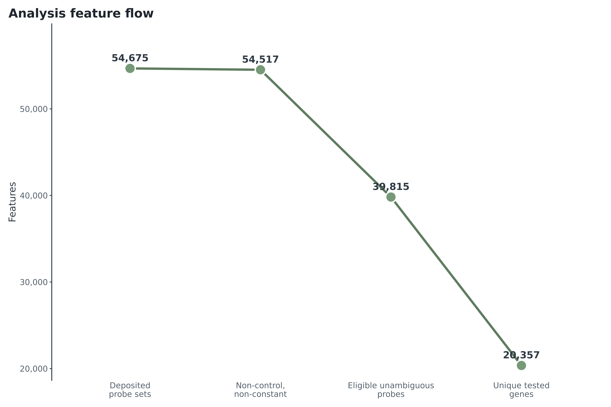
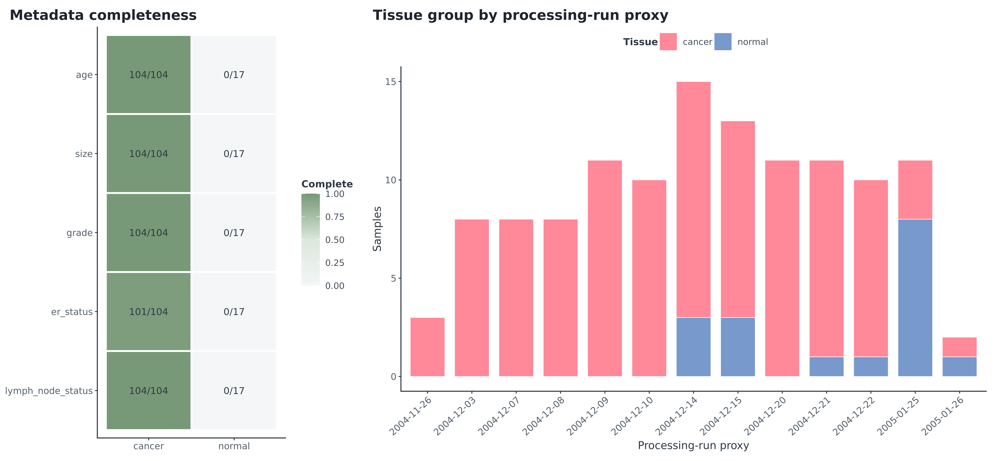
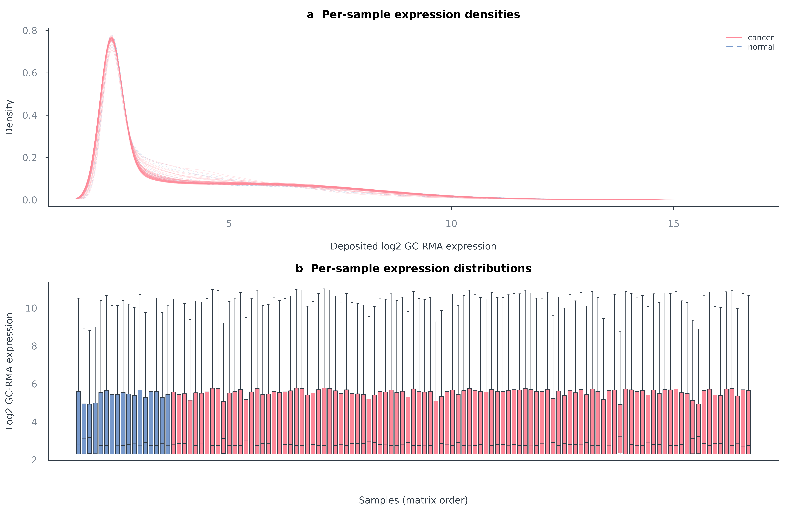
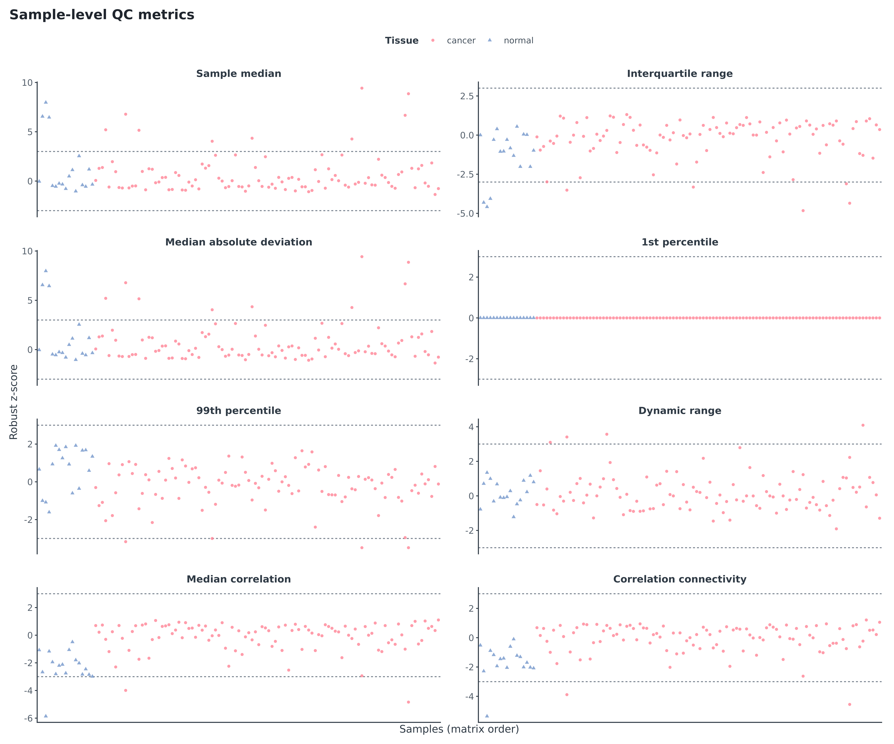
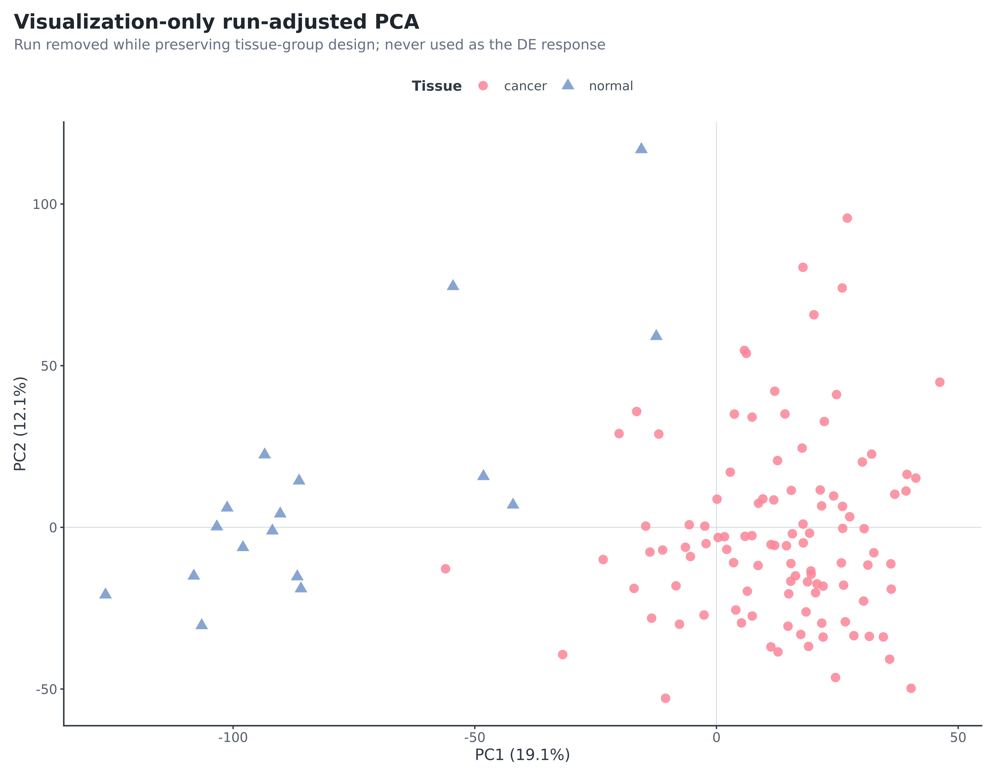
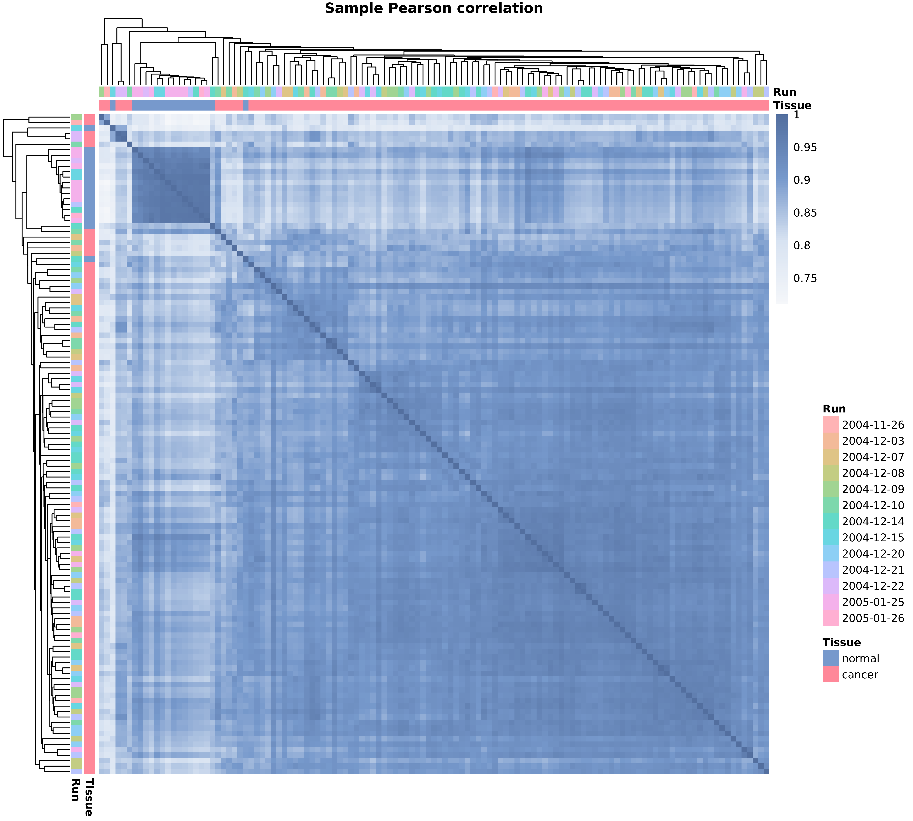
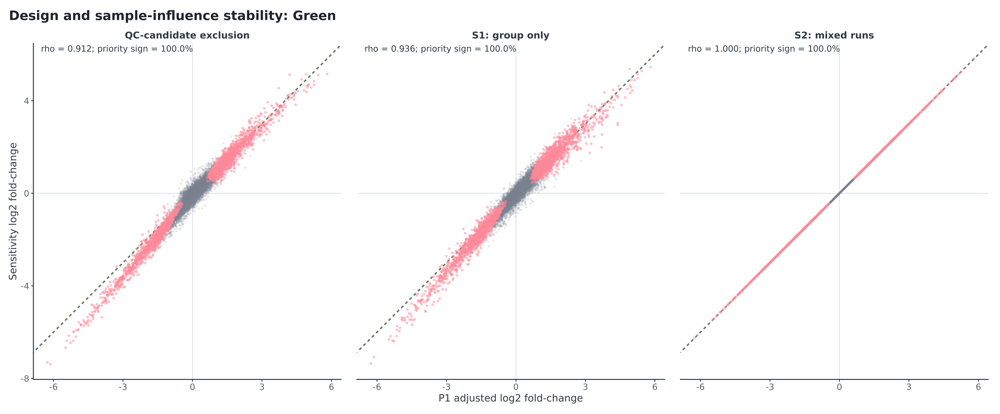

[TOC]

# Disposition

**PASS WITH DOCUMENTED LIMITATIONS:** 32/32 Scientific QA checks and 13/13 reproducibility guards pass; a clean rebuild reproduced 10/10 key tables byte-for-byte. All 121 samples enter P1. Four unusual samples remain after signed review and are removed only in an influence sensitivity.

# Input and metadata

| Metric | Observed |
| --- | --- |
| matrix_sha256 | 43b93f72f1d81838dcd2a5b6ccc3bc1875e46230dad0d7346236773a99e32b76 |
| rows_probe_sets | 54675 |
| columns_samples | 121 |
| unique_probe_ids | 54675 |
| unique_sample_ids | 121 |
| nonfinite_values | 0 |
| minimum | 2.3128116420 |
| maximum | 16.0469027300 |
| constant_probe_sets | 96 |
| AFFX_control_probe_sets | 62 |
| cancer_samples | 104 |
| normal_samples | 17 |
| platform | GPL570 |
| scale_assessment | consistent_with_log2_GCRMA |
| gzip_integrity | passed |

The manifest has 104 cancer and 17 normal GPL570 samples. Normal ages, source category and pairing IDs are absent. GEO's narrative says 20 cancers under 50 while parsed sample fields contain 27 under 50 and 77 at least 50; the discrepancy is preserved, not overwritten.

# Distribution and sample review

| Sample | Group | Run | Signals | Distribution | Correlation | PCA |
| --- | --- | --- | --- | --- | --- | --- |
| GSM1045192 | normal | 2004-12-14 | 2 | TRUE | FALSE | TRUE |
| GSM1045193 | normal | 2004-12-15 | 3 | TRUE | TRUE | TRUE |
| GSM1045217 | cancer | 2004-12-09 | 3 | TRUE | TRUE | TRUE |
| GSM1045302 | cancer | 2004-11-26 | 3 | TRUE | TRUE | TRUE |

The four profiles are unusual but finite and smooth, with plausible expression neighbours. No raw CEL metric corroborates technical failure. They are retained in P1 and jointly excluded only for influence assessment; formal S3 is not applicable.

# PCA and correlation

PC1/PC2 explain 20.3%/10.9% of top-5,000-MAD variation. PC1 tissue R² is 0.678; tissue partial R² given run is 0.540 and run partial R² given tissue is 0.134. Adjusted PCA never enters inference.

# Annotation and statistical QC

| Audit metric | Count/value |
| --- | --- |
| mapping_status:primary_eligible | 39815 |
| mapping_status:unmapped | 9953 |
| mapping_status:one_to_many | 1524 |
| mapping_status:constant | 96 |
| mapping_status:cross_hybridizing_x_at | 3225 |
| mapping_status:control_affx | 62 |
| suffix_class:s_at | 11292 |
| suffix_class:at | 37394 |
| suffix_class:a_at | 1720 |
| suffix_class:x_at | 4207 |
| suffix_class:control | 62 |
| total_probe_sets | 54675 |
| noncontrol_nonconstant_denominator | 54517 |
| primary_eligible_probes | 39815 |
| primary_eligible_fraction | 0.730322651649944 |
| unique_testable_entrez | 20357 |
| genes_with_multiple_eligible_probes | 10281 |

Eligibility is 73.03%, above the frozen 60% stop gate; 20,357 genes exceed the 10,000-gene gate. All 54,675 probes receive one exclusive status.

| Comparison | n | Spearman | Pearson | Priority sign | Median \|effect\| ratio |
| --- | --- | --- | --- | --- | --- |
| S1_group_only | 121 | 0.936 | 0.975 | 100.0% | 1.069 |
| S2_mixed_runs | 62 | 1.000 | 1.000 | 100.0% | 1.000 |
| QC_candidate_exclusion | 117 | 0.912 | 0.975 | 100.0% | 1.100 |
| S4_no_trend | 121 | 1.000 | 1.000 | 100.0% | 1.000 |
| S4_group_aware | 121 | 0.962 | 0.993 | 100.0% | 1.006 |
| median_collapse | 121 | 0.874 | 0.902 | 97.0% | 0.960 |

| Removed run | Normal removed | Cancer removed | Spearman | Priority sign |
| --- | --- | --- | --- | --- |
| 2004-11-26 | 0 | 3 | 1.000 | 100.0% |
| 2004-12-03 | 0 | 8 | 1.000 | 100.0% |
| 2004-12-07 | 0 | 8 | 1.000 | 100.0% |
| 2004-12-08 | 0 | 8 | 1.000 | 100.0% |
| 2004-12-09 | 0 | 11 | 1.000 | 100.0% |
| 2004-12-10 | 0 | 10 | 1.000 | 100.0% |
| 2004-12-14 | 3 | 12 | 0.924 | 100.0% |
| 2004-12-15 | 3 | 10 | 0.951 | 100.0% |
| 2004-12-20 | 0 | 11 | 1.000 | 100.0% |
| 2004-12-21 | 1 | 10 | 0.989 | 100.0% |
| 2004-12-22 | 1 | 9 | 0.988 | 100.0% |
| 2005-01-25 | 8 | 3 | 0.953 | 100.0% |
| 2005-01-26 | 1 | 1 | 0.996 | 100.0% |

The normal-heavy 2005-01-25 removal retains Spearman 0.953 and every priority direction. Median collapse is the least concordant major technical layer (rho 0.874; 97.0% priority direction), and its disagreements are filtered from headline claims rather than hidden.

# Enrichment and licence QA

GO BP universe is 15,588; Reactome universe 10,178. GSEA has all 20,357 moderated-t values exactly once and zero exact ties. KEGG and MSigDB Hallmark have explicit expected gate rows; Reactome is the completed fallback.

# Acceptance summary

| Domain | Checks | Passed | Statuses |
| --- | --- | --- | --- |
| DE | 4 | 4 | PASS, PASS, PASS, PASS |
| annotation | 4 | 4 | PASS, PASS, PASS, PASS |
| artifacts | 1 | 1 | PASS |
| design | 3 | 3 | PASS, PASS, PASS |
| enrichment | 4 | 4 | PASS, PASS, PASS, PASS |
| input | 2 | 2 | PASS, PASS |
| licensing | 2 | 2 | EXPECTED_LICENSE_GATE, EXPECTED_LICENSE_GATE |
| metadata | 5 | 5 | PASS, PASS, PASS, PASS, PASS |
| sample_QC | 2 | 2 | PASS, NOT_APPLICABLE_CONFIRMED_FAILURE_EXCLUSION |
| scope | 1 | 1 | PASS |
| sensitivity | 4 | 4 | PASS, PASS, PASS, PASS |

The full row-level ledger is `results/tables/acceptance_checks.tsv`. Residual limitations are normal provenance/age, unpaired bulk tissue, partial run confounding, cancer heterogeneity, processed-only QC and no external validation.
